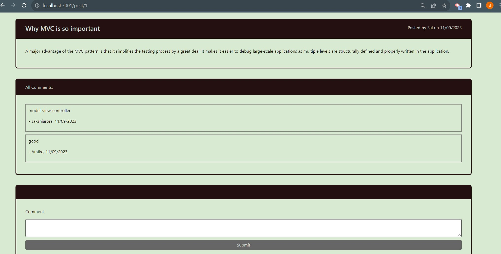

# E-Commerce Backend

## Description

A CMS style blog site, which allows users to publish their blog posts and comment on other that other user's blog post. The app follows the MVC paradigm in its architectural structure, using Handlebars.js as the templating language, Sequelize as the ORM, and the express-session npm package for authentication.


## Table of Contents

- [Installation](#installation)
- [Usage](#usage)
- [Technologies](#technologies)
- [Credits](#credits)
- [Contact Information](#contact-information)

## Installation

Visit the live site at heroku link https://tech-blogpost-6c7d5895dab3.herokuapp.com/ or

To run locally on command line

1. Clone the Repository from GitHub
   ```
   git clone git@github.com:sakshiarora04/tech-blog.git
   ```
2. Install Node.js then Open terminal and run command
   ```
   npm init
   ```
3. Open the terminal and navigate to root directory. Install required dependencies given in package.json by running command:
   ```
   npm install
   ```
4. Create .env file in root directory and enter the required values in DB_USER and DB_PASSWORD

   ```
   DB_NAME='ecommerce_db'
   DB_USER=''
   DB_PASSWORD=''   
   ```   
5. Run mysql -u root -p then enter password. It will open MYSQL shell. Run below given command to create database

   ```
   SOURCE db/schema.sql
   ```
6. By opening the terminal again on root directory. Run below given command to seed database with test data

   ```
   npm run seed
   ```
    In the end, run 'npm start' to start the server and test the routes in insomnia.

## Usage

- User is presented with the homepage, which includes existing blog posts if any have been posted, navigation links for the homepage and the dashboard, and the option to log in
- when user click the existing blog post on homepage, then it displays post title, contents, post creator’s username, and date created and all comments by users on that particular post along with option to leave a comment. User can comment only after login.
- If user is not logged in, then it gets redirected to login page on clicking other navigation links. On login page, user also have option to signup.  
- When user is logged in after entering all required credentials, then all posts by logged-in user and new post button to add new post are displayed and option to logout. On clicking the post title, a new page is opened to edit or delete post and on clicking new post button, it displays a form to create new blog post having fields title and content.
- When user goes to homepage and clicks on existing post to add comment while signed in, then comment is saved and the post is updated to display the comment, the comment creator’s username, and the date created
- When user click on the logout option in the navigation then user gets signed out of the site.


The following images show the web application's appearance and functionality:

- HomePage

  

- Post details

  

- Login and signup

  

  

- Dashboard

  

- New Post

  

- Edit page

  

## Technologies

* Bootstrap & CSS
* JavaScript
* Express.js
* MySQL2
* Sequelize
* Dotenv
* Express, Express-Session, Express-Handlebars
* Connect-Session-Sequelize
* Bcrypt


## Credits

References:

https://sequelize.org/docs/v6/core-concepts/assocs/

## Contact Information

Github Username: [sakshiarora04](https://github.com/sakshiarora04)

Email id: sakshiarora245@gmail.com
